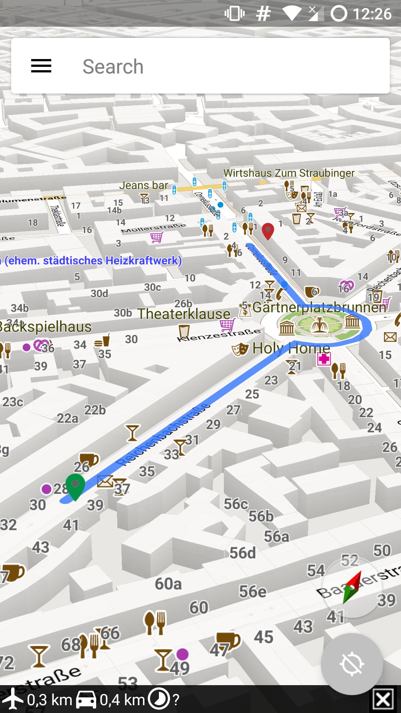

# Dimaps
Dimaps is a derivative of the Android App-Developement in [Mapsforge](https://github.com/mapsforge/vtm)
Instead of using online resources which are cached for maps-view and routing, this is an offline App by using [Graphhopper](https://github.com/graphhopper/graphhopper)
Do not wonder, that the whole project was cloned from Mapsforge. There may will be some changes in other resources e.g. vtm-core.

# V™

For further infomation visit [VTM](https://github.com/mapsforge/vtm) project.

## Screenshots

### Android

